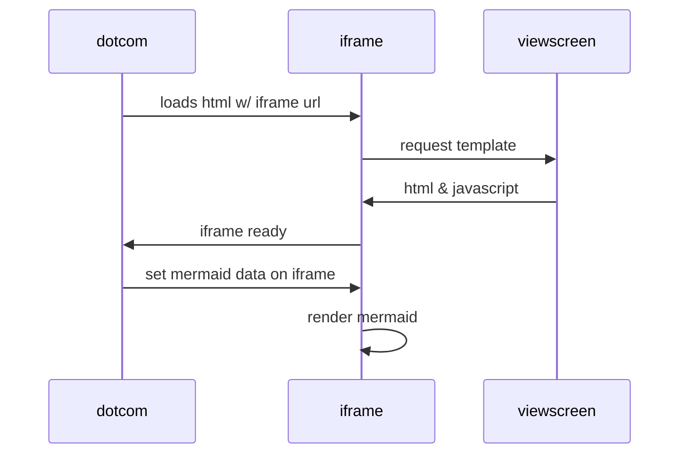

# VSDM
very simple download manager

## How it Works!
you want to download somthing and you have download link

- create folder
- put VDSM Main.sh in root file 
- create folder and rename it to your file
- put download link in 1.txt file
- run main.sh
- done

sequenceDiagram
    participant dotcom
    participant iframe
    participant viewscreen
    dotcom->>iframe: loads html w/ iframe url
    iframe->>viewscreen: request template
    viewscreen->>iframe: html & javascript
    iframe->>dotcom: iframe ready
    dotcom->>iframe: set mermaid data on iframe
    iframe->>iframe: render mermaid
